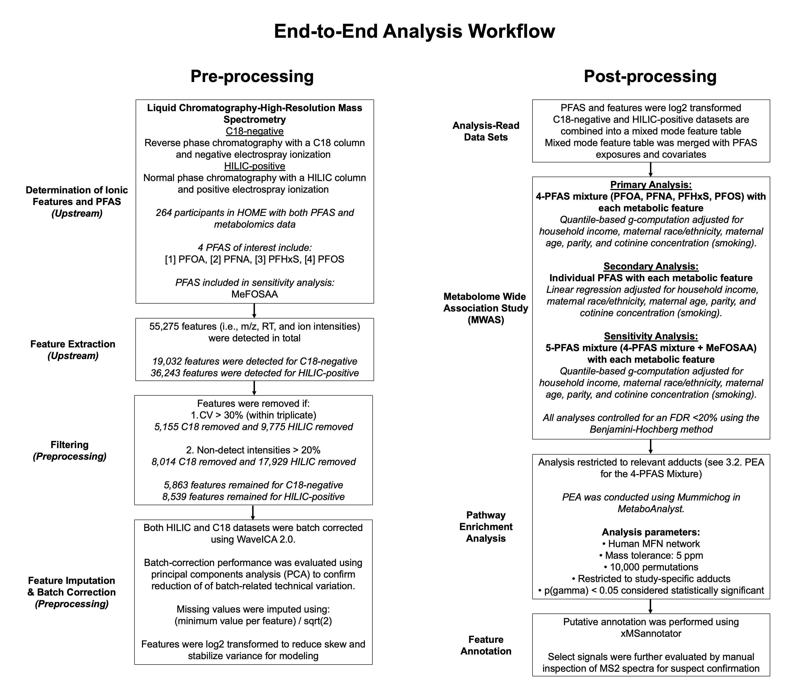

```{r setup, include=FALSE}
# Clear all objects, including hidden objects
rm(list = ls(all.names = TRUE))

#Setting the working dictionary to a pathway on my computer
library(knitr) 
knitr::opts_knit$set(root.dir = '/Users/amber/Desktop/Metabolomics/Github', tidy=TRUE)
```

#  {.tabset}

## Executive Summary
<div style="border: 1px solid #000; padding: 10px; background-color: #FDECEF;">
 <h3 style="text-align: center"> Executive Summary </h3>

<p><span style="font-size: 16px; font-weight: 800;">**Background**</span></p>
Per- and polyfluoroalkyl substances (PFAS) are widespread, persistent synthetic chemicals used in many consumer and industrial products. Prenatal exposure has been linked to adverse health outcomes, but the biological mechanisms underlying these associations are unclear. Untargeted metabolomics can profile thousands of small molecules (metabolites) in blood, offering a way to identify early-life biochemical changes associated with prenatal PFAS exposure.
<br>
<div style="border-left: 3px solid #000; padding: 8px 10px; background-color: #F8BBD0; margin-top: 8px;">
  <p><span style="font-size: 15px; font-weight: 800;">**Objective**</span></p>

Identify cord-serum metabolomic features and metabolic pathways associated with prenatal PFAS exposure to understand how prenatal exposure to PFAS may influence early-life biology. 
</div>
<br>
<p><span style="font-size: 15px; font-weight: 800;">**Data**</span></p>

We analyzed 264 mother–infant dyads in the HOME Study. Four prenatal serum PFAS were measured at ~16 weeks’ gestation (PFOS, PFOA, PFHxS, PFNA). Cord serum was profiled using LC-HRMS, yielding 14,402 metabolomic features (ions). Features were putatively annotated using the Human Metabolome Database (HMDB). 

<p><span style="font-size: 15px; font-weight: 800;">**Approach**</span></p>

<u>Mixture MWAS (primary):</u> Quantile-based g-computation to estimate the joint effect of the 4-PFAS mixture on each metabolomic feature, adjusted for maternal age, race/ethnicity, parity, household income, and smoking status/cotinine.

<u>Single-pollutant MWAS (secondary):</u> Covariate-adjusted linear models for each PFAS individually to contextualize mixture results and identify PFAS-specific signals.

<u>Multiple-testing control:</u> A false discovery rate (FDR; Benjamini–Hochberg) correction across MWAS results to account for thousands of tests.

<u>Biological interpretation:</u> Mummichog pathway enrichment analysis on MWAS outputs to identify pathways most consistently implicated by PFAS exposure.

<u>Sensitivity analysis:</u> Re-ran the mixture MWAS with MeFOSAA added (5-PFAS mixture) and repeated mummichog pathway enrichment to assess the robustness of the primary findings.

<u>Implementation:</u> Analyses were implemented in R using modular scripts/functions to support reproducibility and consistent analysis across thousands of features. Key outputs include MWAS and pathway-enrichment visualizations, plus sensitivity analyses evaluating robustness to mixture specification.

<p><span style="font-size: 15px; font-weight: 800;">**Key Results**</span></p>

The 4-PFAS mixture was associated with four cord-serum features (FDR < 0.20): PFOS, PFHxS, a putatively identified thyroid-related metabolite (3-monoiodo-L-thyronine 4-O-sulfate), and one unidentified feature (m/z 590.0020; RT 441.4 s). 

Pathway enrichment linked the PFAS-mixture to 49 metabolic pathways (p < 0.05), with strongest representation in amino acid, carbohydrate, lipid, cofactor/vitamin metabolism, and glycan biosynthesis/metabolism. Several pathways were consistently enriched across mixture and single-PFAS results (e.g., TCA cycle, keratan sulfate degradation, phytanic acid peroxisomal oxidation), pointing to common metabolic themes. 

Adding MeFOSAA (5-PFAS mixture) produced similar pathway-enrichment patterns, supporting the robustness of the primary findings.
<br>

<div style="border-left: 3px solid #000; padding: 8px 10px; background-color: #F8BBD0; margin-top: 8px;">
  <p><span style="font-size: 15px; font-weight: 800;">**Why it matters**</span></p>
These results point to plausible biological mechanisms linking prenatal PFAS exposure to altered neonatal metabolism. Next steps include formal mediation analyses to evaluate whether these pathways help explain PFAS associations with outcomes such as birthweight or vaccine response.
</div>

<br>
**Reproducibility Note.** HOME Study data is restricted; this project emphasizes transparent, modular analysis code and reproducible figure generation.
</div>

<br>
<br>


## 0. Project Overview

This code was written for the paper "Associations of a Prenatal Serum Per- and Polyfluoroalkyl Substance Mixture with the Cord Serum Metabolome in the HOME Study" by Hall et al. Details for this study can be found here [(Hall et al.)](https://pubs.acs.org/doi/full/10.1021/acs.est.3c07515). In brief, the purpose of this research was to evaluate associations between a mixture of 4 PFAS [perfluorooctanesulfonic acid (PFOS), perfluorooctanoic acid (PFOA), perfluorohexanesulfonic acid (PFHxS), and perfluorononanoic acid (PFNA)] measured at 16 weeks' gestation and cord serum metabolites. The metabolites were identified using an untargeted analysis approach. Additionally, we examined each PFAS individually and included *N*-methylperfluorooctane sulfonamido acetic acid (MeFOSAA) in the mixture analysis to gain insight into their potential influence on the mixture in secondary and sensitivity analyses, respectively.

The code provided here is the corresponding code for our analyses. The workflow and outputs producted by this code can be seen below.

<div style="border: 1px solid #000; padding: 10px; background-color: #F8BBD0">
  <h3 style="text-align: center"> **Workflow and Outputs** </h3>
  **1.  Data Import and Cleaning**
  <ul><li>Cleans and structures data for analyses.</li></ul>
  **2.  Metabolome Wide Association Study (MWAS)**   
  <ul><li><u>Section 2.1</u> Conducts an MWAS using quantile-based g-computation [(Keil et al.)](https://ehp.niehs.nih.gov/doi/full/10.1289/EHP5838). This evaluates associations between a 4-PFAS mixture (PFOS, PFOA, PFNA, PFHxS) with each cord serum metabolite.</li></ul>
  <ul><li><u>Section 2.2</u> Conducts an MWAS using linear regression to identify individual associations between each PFAS and each metabolite. The purpose of this was to observe the potential impact of individual PFAS on the mixture.</li></ul>
  <ul><li><u>Section 2.3</u> Conducts an MWAS using quantile-based g-computation to evaluate associations between the 5-PFAS mixture (4 PFAS mixture plus MeFOSAA) and each metabolite. This was a sensitivity analysis to determine the impact of MeFOSAA on our final results.</li></ul>

**3.  Pathway Enrichment Analysis (PEA)**  
  <ul><li><u>Section 3.2</u> Performs a PEA using *mummichog* via Metaboanalyst 3.2 to identify the association between our 4-PFAS mixture (PFOS, PFOA, PFNA, PFHxS) and specific metabolic pathways [(Li et al)](https://pubmed.ncbi.nlm.nih.gov/23861661/). The dataset used for this analysis was created during the MWAS of the 4-PFAS mixture (Section 2.1).</li></ul>
  <ul><li><u>Section 3.3</u> Performs a PEA using *mummichog* via Metaboanalyst 3.2 to identify the association between each individual PFAS and specific metabolic pathways. This dataset was created during the single PFAS MWAS using linear regression (Section 2.2). The purpose of this was to observe the potential impact of individual PFAS on the mixture.</li></ul>
  <ul><li><u>Section 3.4</u> Performs a PEA using *mummichog* via Metaboanalyst 3.2 to identify the association between a 5-PFAS mixture and specific metabolic pathways. This dataset was created during the MWAS of the 5-PFAS mixture (Section 2.3). This was a sensitivity analysis to determine the impact of MeFOSAA on our final results.</li></ul>
</div>
<br>
**Data Access.** The HOME Study data is restricted. See “Reproducibility / How to Run” for access details and how to run this project.
<br>
<br>
<br>
<br>
<br>

## 1. Data Import and Data Cleaning

### 1.1. Needed Libraries

I first secured all needed packages if I did not have these installed already; this step is required before you can run this code. An example of code to install a package in R is as follows:    
<br>
<div style="border: padding: 10px; width: 250px;">
    install.packages("tidyverse")
</div>

where "tidyverse" can be replaced with any of the packages in the code block below except for MetaboanalystR. MetaboanalystR installation instructions can be found here [(MetaboAnalystR)](https://www.metaboanalyst.ca/docs/RTutorial.xhtml#2.%20Analysis%20Utilities).   
<br>
After all packages are appropriately installed, load all necessary packages using the code below.

```{r Libraries, eval=FALSE, message=FALSE}
#Creating an object named libraries with all of the packages I want to load
libraries <- c("knitr", "tidyverse", "writexl", "qgcomp", "MetaboAnalystR", "fitdistrplus", "RJSONIO")

#Loading the packages and suppressing all error messages and the function return value
invisible(sapply(libraries, library, character.only = TRUE))

#Removing libraries
rm(libraries)
```

### 1.2. Importing Needed Data

After loading all the needed packages, I then imported all of my data. I started with my metabolomics data. This is the focus of the code chunk below.    

For this code chunk I have 2 sets of files:
<br>
  <ul><li>The main C18 and HILIC files (named *C18* and *HILIC*)</li>
  <li>The map C18 and HILIC files (named *C18_map* and *HILIC_map*)</li></ul>
The main files contain feature data (mass to charge ratios (*mz*), retention time, and ion abundances) for each feature for each participant. The map files contain the participant IDs and the metabolomic-specific IDs for each participant. The metabolomic-specific IDs are used in the main *C18* and *HILIC* files where all other imported files use the participant IDs.   

<br>
For the main files, the headers are detailed in the box below.    

<div style="border: 1px solid #000; padding: 10px">
<h5 style="text-align: center"> **Main File Headers**</h5> 
<h6 style="text-align: center">**Dataframe Names: **<b><i>C18</i></b> **and** <b><i>HILIC</i></b></h6>
  <p style="margin: 0; text-indent: 25px"> <u>column 1</u>. *mz*: the mass to charge ratio.
  <p style="margin: 0; text-indent: 25px"> <u>column 2</u>. *time*: retention time.
  <p style="margin: 0; text-indent: 25px"> <u>column 3</u>. *mode*: labeled 1 for C18 and 2 for HILIC files.   
  <p style="margin: 0; text-indent: 25px"> <u>column 4+</u>. a column for each participant containing the the feature data. There are likely several hundred to several thousand features 
  <p style="margin: 0; text-indent: 100px">that have been identified. The header name for each row is the metabolomic-specific ID (which differs from the participant. 
  <p style="margin: 0; text-indent: 100px"> ID). An example of a metabolomics specific ID is *C18_105*.
  </p><br>
*The number of columns in the main files are equal to the number of participants + 3*
</div>
<br>  


For the map files, the headers are detailed in the box below.   

<div style="border: 1px solid #000; padding: 10px">
<h5 style="text-align: center">**Map File Headers**</h5>
<h6 style="text-align: center">**Dataframe Names: **<b><i>C18_map</i></b> **and** <b><i>HILIC_map</i></b></h6>
  <p style="margin: 0; text-indent: 25px"> <u>column 1</u>. *participant_ID*: The assigned participant ID for the data in this study.
  <p style="margin: 0; text-indent: 25px"> <u>column 2</u>. *HILIC_ID* for HILIC data and *C18_ID* for C18 data. IDs that are specific only to the metabolomics data. 
  </p>
</div>
<br>
<div style="display: flex; justify-content: center; align-items: center;">
  <div style="border: 1px solid #000; padding: 10px; background-color: #F8BBD0; width: 500px">
  <div style="text-align: left; text-indent: 10px">
<h4 style="text-align: center">**IMPORTANT**</h4> 
<h5 style="text-align: center">**For this study, I performed the following pre-analysis processing steps for both HILIC and C18 data:**</h5>   
  </div>
  <ul>
  <li>Batch corrected using WaveICA 2.0 [(Deng et al.)](https://pubmed.ncbi.nlm.nih.gov/34542717/) </li>
  <li>Removed if CV >30% (within triplicate) </li>
  <li>Removed values when non-detect intensities >20% </li>
  <li>Imputed missing values using:   
  <br>
  $\begin{aligned}\small\frac{\text{the minimum value per feature}}{\sqrt{2}}\end{aligned}$
  </li>
  <li>l=log2 transformed </li>
  </div>
  </div>
<br>
Next, I imported the feature data and map files using the code chunk below. 
<br>
```{r Import_Feature, eval=FALSE}
# Importing the C18 map file that identifies the IDs
C18_map <- read.csv("Data/C18_map_clean.csv", header = TRUE) # INSERT YOUR FILE PATHWAY HERE

# Importing the HILIC map file that identifies the IDs
HILIC_map <- read.csv("Data/HILIC_map_clean.csv", header = TRUE) # INSERT YOUR FILE PATHWAY HERE

# Importing the batch-corrected C18 data
C18 <- read.csv ('Data/C18_clean.csv', header = TRUE) # INSERT YOUR FILE PATHWAY HERE

# Importing the batch-corrected HILIC data
HILIC <- read.csv ('Data/HILIC_clean.csv', header = TRUE) # INSERT YOUR FILE PATHWAY HERE
```

I then imported the PFAS data. This dataset was named *pfas_only*.

The headers for *pfas_only* are in the box below. 

<div style="border: 1px solid #000; padding: 10px">
<h5 style="text-align: center">**PFAS Dataset Headers**</h5>
<h6 style="text-align: center">**Dataframe Name: **<b><i>pfas_only</i></b></h6>
  <p style="margin: 0; text-indent: 25px"> <u>column 1</u>. *participant_ID*: the assigned participant ID for the data in this study. This was used to merge with the metabolomics data. 
  <p style="margin: 0; text-indent: 100px"> 'participant ID later.
  <p style="margin: 0; text-indent: 25px"> <u>column 2</u>. *pfoa_log2*: log2 transformed serum PFOA concentrations (ng/mL).
  <p style="margin: 0; text-indent: 25px"> <u>column 3</u>. *pfos_log2*: log2 transformed serum PFOS concentrations (ng/mL).
  <p style="margin: 0; text-indent: 25px"> <u>column 4</u>. *pfna_log2*: log2 transformed serum PFNA concentrations (ng/mL).
  <p style="margin: 0; text-indent: 25px"> <u>column 5</u>. *pfhxs_log2*: log2 transformed serum PFHxS concentrations (ng/mL).
  <p style="margin: 0; text-indent: 25px"> <u>column 6</u>. *me_pfosa_acoh_log2*: log2 transformed serum MeFOSAA concentrations (ng/mL).
  </div>
<br>

```{r Import_PFAS, eval=FALSE}
# Importing the PFAS file
pfas_only <- read.csv("Data/pfas_clean.csv", header = TRUE)   %>% # INSERT YOUR FILE PATHWAY HERE 
    mutate(participant_ID = as.character(participant_ID)) #Converting this to a character variable
```

After importing the feature and PFAS data, I imported the covariate data. This dataset was named *cov*.

For *cov*, the headers are as follows:

<div style="border: 1px solid #000; padding: 10px">
<h5 style="text-align: center">**Covariate Dataset Headers**</h5>
<h6 style="text-align: center">**Dataframe Name: **<b><i>cov</i></b></h6>
  <p style="margin: 0; text-indent: 25px"> <u>column 1.</u> *participant_ID*: The assigned participant ID for the data in this study.
  <p style="margin: 0; text-indent: 25px"> <u>column 2.</u> *momagedeliv*: maternal age at delivery (years).
  <p style="margin: 0; text-indent: 25px"> <u>column 3.</u> *ct_16w*: log-10 transformed serum cotinine concentrations measured at 16 weeks' gestation (ng/mL).
  <p style="margin: 0; text-indent: 25px"> <u>column 4.</u> *mom_race*: maternal race (coded as "White, not-Hispanic" and "Other race").
  <p style="margin: 0; text-indent: 25px"> <u>column 5.</u> *midincome*: family income in USD (continuous).
  <p style="margin: 0; text-indent: 25px"> <u>column 6.</u> *parity*: parity (coded as "Nulliparous" and "Parous").
</div>
<br>

```{r Import_Covariate, eval=FALSE}
# Importing covariate data
cov <- read.csv("Data/covariates_clean.csv", header = TRUE) # INSERT YOUR FILE PATHWAY HERE
```

### 1.3. Creating Master Datasets

#### 1.3.1. Exposure Variables and Covariates

The purpose of this code was to create a master dataset named *pfas*. I did this by merging the following datasets into a single dataset:

1.  *pfas_only*: PFAS data
2.  *cov*: covariate data
3.  *C18_map*: contains metabolomic-specific IDs and participant IDs for the C18 data
4.  *HILIC_map*: contains metabolomic-specific IDs and participant IDs for the HILIC data

This is seen below. 

```{r Master_Dataset, eval=FALSE}
# Creating a 'master' PFAS dataset called 'pfas' with both pfas and covariate information
pfas <- pfas_only %>%
  merge(cov, by = "participant_ID") %>%
  merge(C18_map, by = "participant_ID") %>%
  merge(HILIC_map, by = "participant_ID")

# Removing unnecessary dataframes from the global environment
    #map files are used later on so we will keep these for now. 
rm(pfas_only, cov)
```
<br>

#### 1.3.2. Feature Table

Next, I created a new dataframe named *feature_table*. *feature_table* contains only participants with both PFAS and covariate data (i.e. is a subset of the full dataframe; this is for a complete case analysis). This feature table also contains both C18 and HILIC data stacked on top of one another. Columns for the new feature table can be seen below.

<div style="border: 1px solid #000; padding: 10px">
<h5 style="text-align: center"> **Feature Table Headers**</h5> 
<h6 style="text-align: center">**Dataframe Name: **<b><i>feature_table</i></b></h6>
  <p style="margin: 0; text-indent: 25px;"> <u>column 1.</u> *mz*: the mass to charge ratio.
  <p style="margin: 0; text-indent: 25px;"> <u>column 2.</u> *time*: retention time.
  <p style="margin: 0; text-indent: 25px;"> <u>column 3.</u> labeled 1 for C18 and 2 for HILIC files. 
  <p style="margin: 0; text-indent: 25px;"> <u>column 4.</u> a column for each participant containing the ion abundance for each metabolite (referred to as a 'feature'). The header name for 
  <p style="margin: 0; text-indent: 100px;"> each row is the participant ID. An example of a participant ID is 'C18_1'.  
<br>
*The number of columns in the new dataframe is equal to the number of participants + 3.*
</div>
<br>
Below is the code I used to create this feature table. 
<br>
```{r Feature_Table, eval=FALSE}
# Creating a 'participant' file that is a list of participants. 
participants <- unique(pfas["participant_ID"])

# Join the C18_map data frame to the participants data frame 
participants <- inner_join(participants, C18_map, by = "participant_ID")

# Join the HILIC_map data frame to the participants data frame
participants <- inner_join(participants, HILIC_map, by = "participant_ID")

#Creating a string of characters called 'C18_ID' that contain all of the metabolomic-specific IDs for C18 as well as mz, rt, and mode
C18_ID <- c("mz", "time", "mode", participants$C18_ID)
  
# Selecting only participants from the C18 file that contain both pfas and covariate information
C18 <- subset(C18, select = C18_ID)

#Creating a general metabolomics-specific ID rather than one specific for C18 data
    #As of now participant 1 will correspond to both C18_1 and HILIC_1. Here I drop the C18 portion and replace it with ID changing the value to ID_1. This will allow me to stack the HILIC and C18 data ontop of one another.  
colnames(C18) <- gsub("C18","ID", colnames(C18)) 
  
#Creating a list called 'HILIC_ID' that contain all of the metabolomic-specific IDs for HILIC as well as mz, rt, and mode
HILIC_ID <- c("mz", "time", "mode", participants$HILIC_ID)

# Selecting only participants from the HILIC file that contain both pfas and covariate information
HILIC <- subset(HILIC, select = HILIC_ID)

#Creating a general metabolomics-specific ID rather than one specific for HILIC data
colnames(HILIC) <- gsub("HILIC","ID", colnames(HILIC))
  
# Creating a 'master' dataframe called 'feature' with both the C18 and HILIC data stacked on top of one another
feature_table <- bind_rows(C18, HILIC)  

#Dropping unneeded datafiles and values
rm(participants, C18_ID, HILIC_ID, C18_map, HILIC_map, C18, HILIC)
```

### 1.4. Splitting the Dataset for Analysis

The purpose of this chunk was to create a list that 'splits' each individual feature into their own tibble. Each individual tibble contains the mass-to-charge ratio (*mz*) and retention time (*time*) for that metabolite as well as the pfas and covariate data for each participant. The purpose of doing this is so that we can run each individual metabolite independently through our MWAS.

```{r Splitting_For_Analysis, eval=FALSE}
# Adding a new feature column named 'feature_id'. This columns contains numbers 1,2,3,...N. This column will be used later for splitting the feature table
feature_table <- cbind(feature_id = 1:nrow(feature_table), feature_table)

# Pivoting the dataset to a 'long file'. This contains 6 values (feature_ID, mz, time, mode, name [metabolomic-specific participant_ID], and value [ion abundance]). 
long_df <- feature_table %>% pivot_longer(!c(1:4))

# Replacing the C18 value names to a general ID to match the long_df
pfas <- pfas  %>%
  mutate(C18_ID = str_replace(C18_ID, "C18", "ID")) #Dropping the C18 to merge with the long dataset

# Creating a long feature table to analyze
analysis_pfas <- inner_join(long_df, pfas, by= c("name"= "C18_ID"))
split_pfas <- split(analysis_pfas, f=analysis_pfas$feature_id)

# Removing unnecessary dataframes
rm(long_df, analysis_pfas, feature_table, pfas)
```

## 2. Metabolome Wide Association Study (MWAS)

### About Quantile-Based g-Computation
The purpose of quantile-based g-computation (QGComp) is to examine the joint effects of a mixture PFAS with relation to an outcome of interest. QGComp accomplishes this by calculating the parameters of a marginal structural model. For the QGComp models in our study, these parameters characterize the difference in feature intensity resulting from a simultaneous, one-quantile increase of all PFAS in the mixture. Resources on quantile-based g-computation are in the box below.   

<br>
<div style="border: 1px solid #000; padding: 10px; background-color: #F8BBD0">
<div style="display: flex; justify-content: center; align-items: center;">
  <div style="text-align: left; text-indent: 10px">
<h5>**Resources for Quantile-Based g-Computation:**</h5>   
  </div>
  <ul>
  <li>The original paper [(Keil et al.)](https://ehp.niehs.nih.gov/doi/full/10.1289/EHP5838).</li>
  <li>Comprehensive R Archive Network (CRAN) [(Cran website)](https://cran.r-project.org/web/packages/qgcomp/).</li>
  <li>Github page [(QGComp Github)](https://github.com/alexpkeil1/qgcomp)
  </ul>
</div>
</div>
<div>
<br>
</div>
### 2.1. MWAS for the 4-PFAS Mixture (Quantile-Based g-Computation)
This chunk of code is the primary Metabolome Wide Association Study (MWAS) analysis for our study  [(Hall et al.)](https://pubs.acs.org/doi/full/10.1021/acs.est.3c07515). We evaluated whether the joint effect of our 4 PFAS of interest (PFOS, PFOA, PFHxS, PFNA) were associated with the ion abundance for each feature, adjusting for parity, family income, maternal age, maternal race, and cotinine concentrations. 

The results of these models are outputted to 3 files, detailed in the box below. 

<div style="border: 1px solid #000; padding: 10px">
<h5 style="text-align: center"> **Files Outputted from the 4-PFAS MWAS Code**</h5> 
  <p style="margin: 0; text-indent: 25px"> <u>File 1</u>:* a full or overall file that contains all the results
  <p style="margin: 0; text-indent: 25px"> <u>File 2</u>: a significant file that contains significant values (i.e. those with FDR values <0.20)
  <p style="margin: 0; text-indent: 25px"> <u>File 3</u>:* a metaboanalyst file that contains only the variables needed to import into metaboanalyst (*mz*, *time*, *p-value*, *mode*).   
  <br>
*Files 1 and 3 contain 9 columns. These columns are:
  <ol>
  <li>*m.z*: the mass to charge ratio </li>
  <li>*r.t*: retention time </li>
  <li>*psi*: effect estimate for the joint effects of these 4 PFAS. For this model, psi represents the difference in feature intensity resulting from a simultaneous, one-quantile increase of all PFAS in the mixture </li>
  <li>*SE*: standard error </li>
  <li>*ci_lower*: lower 95% confidence interval</li>
  <li>*ci_upper*: upper 95% confidence interval</li>
  <li>*p.value*: unadjusted p-value (before FDR correction)</li> 
  <li>*mode*: negative (C18) or positive (HILIC)</li> 
  <li>*FDR*: false discovery rate (FDR) corrected p-value</li>
</div>
<br>
**For the code below, you will need to specify your own file pathways to export the results. Furthermore, if you are adjusting for covariates, you will need to update the variables in the code below**. *value* in this code refers to the ion abundance of each feature. 

```{r QGComp_4_PFAS, eval=FALSE}
# Creating a list of exposure names
Xnm <- c("pfoa_log2","pfos_log2","pfna_log2","pfhxs_log2")

# Writing a function that loops through each individual features and runs quantile-based g-computation, adjusting for covariates.
find_psi_4PFAS <- function(list) {
  num_metabolites <- length(list)
  res_mat <- matrix(NA, nrow = num_metabolites, ncol = 8)
  colnames(res_mat) <- c("m.z", "r.t", "psi", "SE", "ci_lower", "ci_upper", "p.value", "mode")
  for (i in 1:num_metabolites) {
    data_matrix <- as.matrix(list[[i]])
    # Quantile-based g-computation model
    res <- qgcomp.noboot(value ~ midincome + mom_race + momagedeliv + ct_16w + parity +
                           pfoa_log2 + pfos_log2 + pfna_log2 + pfhxs_log2,
                         expnms = Xnm, data = list[[i]], family = gaussian())
    # Outputting needed values
    res_mat[i, 1] <- as.numeric(list[[i]][1, 2]) # mz
    res_mat[i, 2] <- as.numeric(list[[i]][1, 3]) # time ie. r.t
    res_mat[i, 3] <- as.numeric(res$psi) # psi
    res_mat[i,4] <- as.numeric((res$ci[2]-res$ci[1])/3.92) #SE
    res_mat[i, 5:6] <- res$ci # upper and lower confidence interval
    res_mat[i, 7] <- as.numeric(res$pval[2]) # p-value
    res_mat[i, 8] <- as.numeric(list[[i]][1, 4]) # mode
  # Applying the False Discovery Rate (FDR) correction
  res_df <- data.frame(res_mat)
  res_df$FDR <- p.adjust(res_df$p.value, method = 'BH')
  # Re-coding mode to 'negative' and 'positive'
  res_df$mode[res_df$mode == 1] <- "negative"
  res_df$mode[res_df$mode == 2] <- "positive"
  return(res_df)

# Creating files
qg_comp_4_FULL <- suppressWarnings(as.data.frame(find_psi_4PFAS(split_pfas)))
qg_comp_4_SIG <- qg_comp_4_FULL[qg_comp_4_FULL$FDR< 0.2,]
qg_comp_4_METABOANALYST <- subset(qg_comp_4_FULL, select=c("m.z", "p.value","r.t", "mode"))

# Writing the files out
write.csv(qg_comp_4_FULL, 'Final Datasets/Full/QG_comp_full_4PFAS.csv', row.names = TRUE) 
write.csv(qg_comp_4_SIG, 'Final Datasets/Significant only/QG_comp_sig_4PFAS.csv', row.names = TRUE)
write.csv(qg_comp_4_METABOANALYST, 'Final Datasets/Metaboanalyst/QG_comp_full_METABOLOMICS_4PFAS.csv', row.names = TRUE)

# Removing unneeded files and functions from the global environment
rm(Xnm, qg_comp_4_FULL, qg_comp_4_METABOANALYST, qg_comp_4_SIG, find_psi_4PFAS) 
```

### 2.2. MWAS for Individual PFAS (Linear Regression)

The code chunk below evaluates whether each individual PFAS (PFOS, PFOA, PFHxS, PFNA, or MeFOSAA) is associated with the ion abundance for each feature, adjusting for parity, family income, maternal age, maternal race, and cotinine concentrations. The purpose of this was to observe the potential impact of the individual metabolites on the 4-PFAS mixture (detailed in Section 2.1).   

The results of these models are outputted to 3 files, detailed in the box below.

<div style="border: 1px solid #000; padding: 10px">
<h5 style="text-align: center"> **Files Outputted from the Single Pollutant PFAS MWAS Code**</h5> 
  <p style="margin: 0; text-indent: 25px"> <u>File 1</u>:* a full or overall file that contains all the results
  <p style="margin: 0; text-indent: 25px"> <u>File 2</u>: a significant file that contains significant values (i.e. those with FDR values <0.20)
  <p style="margin: 0; text-indent: 25px"> <u>File 3</u>:* a metaboanalyst file that contains only the variables needed to import into metaboanalyst (*mz*, *time*, *p-value*, *mode*).   
  <br>
*Files 1 and 3 contain 9 columns. These columns are:
  <ol>
  <li>*m.z*: the mass to charge ratio </li>
  <li>*r.t*: retention time </li>
  <li>*psi*: effect estimate for the joint effects of these 4 PFAS. For this model, psi represents the difference in feature intensity resulting from a simultaneous, one-quantile increase of all PFAS in the mixture </li>
  <li>*SE*: standard error </li>
  <li>*ci_lower*: lower 95% confidence interval</li>
  <li>*ci_upper*: upper 95% confidence interval</li>
  <li>*p.value*: unadjusted p-value (before FDR correction)</li> 
  <li>*mode*: negative (C18) or positive (HILIC)</li> 
  <li>*FDR*: false discovery rate (FDR) corrected p-value</li>
</div>
<br>

**For the code below, you will need to specify your own file pathways to export the results. Furthermore, if you are adjusting for covariates, you will need to update the variables in the model.** As a reminder, all PFAS have already been log2 transformed. *value* in this code refers to the ion abundance of each feature.

```{r Linear_PFAS, eval=FALSE}
# Creating the function
find_linear_pfas <- function(list, PFAS) {
  num_metabolites <- length(list)
  res_mat <- matrix(NA, nrow = num_metabolites, ncol = 8) # Add one more column for standard error
  colnames(res_mat) <- c("m.z", "r.t", "Beta", "SE", "ci_lower", "ci_upper", "p.value", "mode")
  for (i in 1:num_metabolites) {
    data_matrix <- as.matrix(list[[i]])
    # Fitting linear regression model with specified PFAS
    formula_str <- paste0("value ~ ", PFAS, " + midincome + mom_race + momagedeliv + ct_16w + parity")
    res <- lm(formula_str, data = list[[i]])
    # Filling in results matrix
    res_mat[i, 1] <- as.numeric(list[[i]][1, 2]) #mz
    res_mat[i, 2] <- as.numeric(list[[i]][1, 3]) #time
    res_mat[i, 3] <- res$coefficients[PFAS] #Beta estimate
    res_mat[i, 4] <- summary(res)$coefficients[PFAS, "Std. Error"] #standard error
    res_mat[i, 5:6] <- confint(res, PFAS, level = 0.95) #upper and lower confidence interval
    res_mat[i, 7] <- summary(res)$coefficients[PFAS, "Pr(>|t|)"] #p-value
    res_mat[i, 8] <- as.numeric(list[[i]][1, 4]) #mode (i.e. direction)
  # Converting matrix to data frame and add FDR column
  res_df <- as.data.frame(res_mat)
  colnames(res_df) <- colnames(res_mat)
  res_df$FDR <- p.adjust(res_df$p.value, method = 'BH')
  # Recoding mode column
  res_df$mode[res_df$mode == 1] <- "negative" #C18
  res_df$mode[res_df$mode == 2] <- "positive" #HILIC
  #Returns your wanted values
  return(res_df)

# Creating the datafiles
  # PFOA
  PFOA_Full <- find_linear_pfas(split_pfas, "pfoa_log2")
  PFOA_SIG <- PFOA_Full[PFOA_Full$FDR< 0.2,]
  PFOA_METABOANALYST <- subset(PFOA_Full, select=c("m.z", "p.value","r.t", "mode"))
  
  # PFOS
  PFOS_Full <- find_linear_pfas(split_pfas, "pfos_log2")
  PFOS_SIG <- PFOS_Full[PFOS_Full$FDR< 0.2,]
  PFOS_METABOANALYST <- subset(PFOS_Full, select=c("m.z", "p.value","r.t", "mode"))
  
  # PFNA
  PFNA_Full <- find_linear_pfas(split_pfas, "pfna_log2")
  PFNA_SIG <- PFNA_Full[PFNA_Full$FDR< 0.2,]
  PFNA_METABOANALYST <- subset(PFNA_Full, select=c("m.z", "p.value","r.t", "mode"))
  
  # PFHxS
  PFHxS_Full <- find_linear_pfas(split_pfas, "pfhxs_log2")
  PFHxS_SIG <- PFHxS_Full[PFHxS_Full$FDR< 0.2,]
  PFHxS_METABOANALYST <- subset(PFHxS_Full, select=c("m.z", "p.value","r.t", "mode"))
  
  # MEFOSAA
  MEFOSAA_Full <- find_linear_pfas(split_pfas, "me_pfosa_acoh_log2")
  MEFOSAA_SIG <- MEFOSAA_Full[MEFOSAA_Full$FDR< 0.2,]
  MEFOSAA_METABOANALYST <- subset(MEFOSAA_Full, select=c("m.z", "p.value","r.t", "mode"))

# Writing the files out
  # PFOA
  write.csv(PFOA_Full, 'Final Datasets/Full/Individual PFAS/PFOA_Full.csv', row.names = TRUE) 
  write.csv(PFOA_SIG, 'Final Datasets/Significant only/Individual PFAS/PFOA_SIG.csv', row.names = TRUE) 
  write.csv(PFOA_METABOANALYST, 'Final Datasets/Metaboanalyst/Individual PFAS/PFOA_METABOANALYST.csv',   row.names = TRUE) 

  # PFOS
  write.csv(PFOS_Full, 'Final Datasets/Full/Individual PFAS/PFOS_Full.csv', row.names = TRUE) 
  write.csv(PFOS_SIG, 'Final Datasets/Significant only/Individual PFAS/PFOS_SIG.csv', row.names = TRUE) 
  write.csv(PFOS_METABOANALYST, 'Final Datasets/Metaboanalyst/Individual PFAS/PFOS_METABOANALYST.csv', row.names = TRUE) 
  # PFNA
  write.csv(PFNA_Full, 'Final Datasets/Full/Individual PFAS/PFNA_Full.csv', row.names = TRUE) 
  write.csv(PFNA_SIG, 'Final Datasets/Significant only/Individual PFAS/PFNA_SIG.csv', row.names = TRUE) 
  write.csv(PFNA_METABOANALYST, 'Final Datasets/Metaboanalyst/Individual PFAS/PFNA_METABOANALYST.csv', row.names = TRUE) 
# PFHxS
  write.csv(PFHxS_Full, 'Final Datasets/Full/Individual PFAS/PFHxS_Full.csv', row.names = TRUE) 
  write.csv(PFHxS_SIG, 'Final Datasets/Significant only/Individual PFAS/PFHxS_SIG.csv', row.names = TRUE) 
  write.csv(PFHxS_METABOANALYST, 'Final Datasets/Metaboanalyst/Individual PFAS/PFHxS_METABOANALYST.csv', row.names = TRUE) 

# MEFOSAA
  write.csv(MEFOSAA_Full, 'Final Datasets/Full/Individual PFAS/ME_PFOSA_ACOH_Full.csv', row.names = TRUE) 
  write.csv(MEFOSAA_SIG, 'Final Datasets/Significant only/Individual PFAS/ME_PFOSA_ACOH_SIG.csv', row.names = TRUE) 
  write.csv(MEFOSAA_METABOANALYST, 'Final Datasets/Metaboanalyst/Individual PFAS/ME_PFOSA_ACOH_METABOANALYST.csv', row.names = TRUE) 

# Removing unnecessary files and functions
rm(PFOA_Full, PFOA_SIG, PFOA_METABOANALYST, 
   PFOS_Full, PFOS_SIG, PFOS_METABOANALYST, 
   PFNA_Full, PFNA_SIG, PFNA_METABOANALYST, 
   PFHxS_Full, PFHxS_SIG, PFHxS_METABOANALYST,
   MEFOSAA_Full, MEFOSAA_SIG, MEFOSAA_METABOANALYST, 
  find_linear_pfas) 
```

### 2.3. *Sensitivity Analysis*: MWAS for the 5-PFAS Mixture

This is a sensitivity analysis to evaluate the impact of MeFOSAA on the original 4-PFAS mixture. In this code chunk, we evaluated whether the joint effect of a 5-PFAS mixture (4-PFAS mixture *detailed in section 2.1* plus MeFOSAA) were associated with the ion abundance for each feature, adjusting for parity, family income, maternal age, maternal race, and cotinine concentrations. This was accomplished using a quantile-based g-computation model. The purpose of this sensitivity analysis was to determine the impact of MeFOSAA on our final results.

The results of these models are outputted to 3 files:

<div style="border: 1px solid #000; padding: 10px">
<h5 style="text-align: center"> **Files Outputted from the 5-PFAS MWAS Code**</h5> 
  <p style="margin: 0; text-indent: 25px"> <u>File 1</u>:* a full or overall file that contains all the results
  <p style="margin: 0; text-indent: 25px"> <u>File 2</u>: a significant file that contains significant values (i.e. those with FDR values <0.20)
  <p style="margin: 0; text-indent: 25px"> <u>File 3</u>:* a metaboanalyst file that contains only the variables needed to import into metaboanalyst (*mz*, *time*, *p-value*, *mode*).   
  <br>
*Files 1 and 3 contain 9 columns. These columns are:
  <ol>
  <li>*m.z*: the mass to charge ratio </li>
  <li>*r.t*: retention time </li>
  <li>*psi*: effect estimate for the joint effects of these 4 PFAS. For this model, psi represents the difference in feature intensity resulting from a simultaneous, one-quantile increase of all PFAS in the mixture </li>
  <li>*SE*: standard error </li>
  <li>*ci_lower*: lower 95% confidence interval</li>
  <li>*ci_upper*: upper 95% confidence interval</li>
  <li>*p.value*: unadjusted p-value (before FDR correction)</li> 
  <li>*mode*: negative (C18) or positive (HILIC)</li> 
  <li>*FDR*: false discovery rate (FDR) corrected p-value</li>
</div>
<br>

**You will need to specify your own file pathways to export the results. Furthermore, if you are adjusting for covariates, you will need to update the variables in the code below**. *value* in the code below refers to the ion abundance of each feature. 

```{r QGComp_PFAS_MeFOSAA, eval=FALSE}
# Create a exposure list of the names of each of the 5 PFAS
Xnm <- c("pfoa_log2","pfos_log2","pfna_log2","pfhxs_log2", "me_pfosa_acoh_log2")

# Writing a function that loops through each individual features and runs quantile-based g-computation, adjusting for covariates.
find_psi_4PFAS_and_ME_PFOSA <- function(list) {
  num_metabolites <- length(list)
  res_mat <- matrix(NA, nrow = num_metabolites, ncol = 8)
  colnames(res_mat) <- c("m.z", "r.t", "psi", "SE", "ci_lower", "ci_upper", "p.value", "mode")
  for (i in 1:num_metabolites) {
    data_matrix <- as.matrix(list[[i]])
    # Quantile G-comp model
    res <- qgcomp.noboot(value ~ midincome + mom_race + momagedeliv + ct_16w + parity +
                           pfoa_log2 + pfos_log2 + pfna_log2 + pfhxs_log2 + 
                           me_pfosa_acoh_log2,
                         expnms = Xnm, data = list[[i]], family = gaussian())
    # Outputting needed values
    res_mat[i, 1] <- as.numeric(list[[i]][1, 2]) # mz
    res_mat[i, 2] <- as.numeric(list[[i]][1, 3]) # time ie. r.t
    res_mat[i, 3] <- as.numeric(res$psi) # psi
    res_mat[i,4] <- as.numeric((res$ci[2]-res$ci[1])/3.92) #SE
    res_mat[i, 5:6] <- res$ci # upper and lower confidence interval
    res_mat[i, 7] <- as.numeric(res$pval[2]) # p-value
    res_mat[i, 8] <- as.numeric(list[[i]][1, 4]) # mode
  # Applying the FDR correction
  res_df <- data.frame(res_mat)
  res_df$FDR <- p.adjust(res_df$p.value, method = 'BH')
  # Recoding mode to 'megative' and 'positive'
  res_df$mode[res_df$mode == 1] <- "negative"
  res_df$mode[res_df$mode == 2] <- "positive"
  return(res_df)

# Creating files
qg_comp_5_FULL <- suppressWarnings(as.data.frame(find_psi_4PFAS_and_ME_PFOSA(split_pfas)))
qg_comp_5_SIG <- qg_comp_5_FULL[qg_comp_5_FULL$FDR< 0.2,]
qg_comp_5_METABOANALYST <- subset(qg_comp_5_FULL, select=c("m.z", "p.value","r.t", "mode"))

# Writing the files out
write.csv(qg_comp_5_FULL, 'Final Datasets/Full/QG_comp_full_4PFAS_and_ME_PFOSA.csv', row.names = TRUE) 
write.csv(qg_comp_5_SIG, 'Final Datasets/Significant only/QG_comp_sig_4PFAS_and_ME_PFOSA.csv', row.names = TRUE)
write.csv(qg_comp_5_METABOANALYST, 'Final Datasets/Metaboanalyst/QG_comp_full_METABOLOMICS_4PFAS_and_ME_PFOSA.csv', row.names = TRUE)

# Removing unneeded files and functions from the global environment
rm(Xnm, qg_comp_5_FULL, qg_comp_5_METABOANALYST, qg_comp_5_SIG, find_psi_4PFAS_and_ME_PFOSA, split_pfas) 
```

## 3. Pathway Enrichment Analysis (PEA)

### About MetaboanalystR

MetaboAnalystR is the R package associated with MetaboAnalyst. MetaboAnalystR performs a pathway enrichment analysis (PEA) using *mummichog* to identify associations between an exposure of interest, such as PFAS, and metabolic pathways. More information on *mummichog* can be found here [(Li et al.)](https://pubmed.ncbi.nlm.nih.gov/23861661/).   
<br>
Information on Metaboanalyst can be found at [(MetaboAnalyst)](https://www.metaboanalyst.ca/). Additionally, information on MetaboAnalystR can be found at [(MetaboanalystR)](https://www.metaboanalyst.ca/docs/RTutorial.xhtml).

### 3.1. Specifying Specific Adducts

For our PEA, we first specify the adducts permitted for our study. This determination was made by our lead chemist Dr. Kate Manz. The purpose of adduct restriction is to restrict our results to the adducts that could potentially form based on our mobile phases and internal standards. As such, this may differ from study to study. 

A full list of the adducts available for MetaboAnalyst can be found here [(adduct list)](https://raw.githubusercontent.com/jsychong/MetaboAnalystR/master/mixed_add_list.txt).

```{r Adduct_Customization, eval=FALSE}
# Creating a vector that contains the customized adducts for our study. 
add.vec <- c("M+FA-H [1-]","M-H [1-]","2M-H [1-]","M-H+O [1-]","M(C13)-H [1-]",
             "2M+FA-H [1-]","M-3H [3-]","M-2H [2-]","M+ACN-H [1-]",
             "M+HCOO [1-]","M+CH3COO [1-]","M-H2O-H [1-]","M [1+]","M+H [1+]",
             "M+2H [2+]","M+3H [3+]","M+H2O+H [1+]","M-H2O+H [1+]",
             "M(C13)+H [1+]","M(C13)+2H [2+]","M(C13)+3H [3+]","M-NH3+H [1+]",
             "M+ACN+H [1+]","M+ACN+2H [2+]","M+2ACN+2H [2+]","M+3ACN+2H [2+]",
             "M+NH4 [1+]","M+H+NH4 [2+]","2M+H [1+]","2M+ACN+H [1+]")
```

### 3.2. PEA for the 4-PFAS Mixture

Using the results from the 4-PFAS Mixture MWAS (Section 2.1), we conducted a *mummichog* PEA to identify enriched pathways using MetaboAnalystR. 

Details regarding our untargeted analysis are described in detail in our paper  [(Hall et al.)](https://pubs.acs.org/doi/full/10.1021/acs.est.3c07515). From this information, we restricted to adducts that could potentially form based on our mobile phases and internal standards (the specific adducts used in our analyses are detailed in the box below). This PEA was conducted using the human MFN network, a mass tolerance of 5ppm, 10,000 permutations and a p-value cutoff <0.05 to delineate between significantly enriched and non-significantly enriched features. Furthermore, this analysis was restricted to metabolite data sets containing at least 3 entries. A p(gamma) < 0.05 was considered statistically significant.   
<br>

<div style="border: 1px solid #000; padding: 10px; text-align: center">
<h5 style="text-align: center"> **Adducts We Restricted to in Our Analyses**</h5> 
  <p><u>Negative Ion Mode</u></p>
  <p>M+FA-H [1-], M-H [1-], 2M-H [1-], M-H2O-H [1-], M-H+O [1-], M(C13)-H [1-], 2M+FA-H [1-], M-3H [3-], M-2H [2-], M+ACN-H [1-], M+HCOO[1-], and M+CH3COO [1-]</p>
  <p><u>Positive Ion Mode</u></p>
  <p>M [1+], M+H [1+], M+2H [2+], M+3H [3+], M+H2O+H [1+], M-H2O+H [1+], M(C13)+H [1+], M(C13)+2H [2+], M(C13)+3H [3+], M-NH3+H [1+], M+ACN+H [1+], M+ACN+2H [2+], M+2ACN+2H [2+], M+3ACN+2H [2+], M+NH4 [1+], M+H+NH4 [2+], 2M+H [1+], and 2M+ACN+H [1+]</p>
</div>
<br>
**You will need to specify your own file pathways to export the results. The files imported for this analysis were created and exported out in Section 2.1.**

```{r PEA_4PFAS, eval=FALSE}
# Creating an object for storing data for mummichog
mSet4 <- InitDataObjects("mass_all", "mummichog", FALSE)

# Ranking the peaks by their p-value
mSet4 <- SetPeakFormat(mSet4, "rmp") 

# Specifying
    #a. a mass tolerance of 5.0
    #b. mixed mode
    #c.not enforcing primary ions as this is exploratory
mSet4 <- UpdateInstrumentParameters(mSet4, 5.0, "mixed", "no"); 

# Reading in the specific peak list
mSet4 <- Read.PeakListData(mSet4, "Final Datasets/Metaboanalyst/QG_comp_full_METABOLOMICS_4PFAS.csv"); # INSERT YOUR PATHWAY HERE

# Performing a sanity check to ensure the data is in a suitable format for further analysis
mSet4 <- SanityCheckMummichogData(mSet4)

# Adding in the adduct data
mSet4 <- Setup.AdductData(mSet4, add.vec); 

# Specifying both positive and negative adducts
mSet4 <- PerformAdductMapping(mSet4, "mixed") 

# Running the mummichog algorithm using selected adducts and version 2 of the mummichog algorithm
mSet4 <- SetPeakEnrichMethod(mSet4, "mum", "v2")
mSet4 <- SetMummichogPval(mSet4, .05) #Specifying a p-value of 0.05

# Selecting the human MFN network, selecting the current human MFN library, restricting to metabolite datasets with at least 3 entries, and running 10,000 permutations. 
mSet4 <- PerformPSEA(mSet4, "hsa_mfn", "current", 3 , 10000)

# Storing the results as a dataframe
mummi_results_4pfas <- as.data.frame(mSet4$mummi.resmat)

# Restricting the results to those with a p(gamma) <0.05
mummi_results_4pfas <- mummi_results_4pfas[mummi_results_4pfas$Gamma< 0.05, ]

# Storing the results as a .csv
write.csv(mummi_results_4pfas, "/Users/amber/Desktop/mummi_4pfas_res.csv")

# Removing unneeded datasets and values
rm(all.mzsn, mdata.all, mdata.siggenes, metaboanalyst_env, mSet4, mummi_results_4pfas, anal.type, api.base, meta.selected, module.count, msg.vec, primary.user, smpdbpw.count, url.pre)
```

### 3.3. PEA for Individual PFAS

Using the results from the single pollutant MWAS models (Section 2.2), we conducted a *mummichog* PEA to identify enriched pathways using MetaboAnalystR. This was part of a secondary analysis that evaluated the impact of individual PFAS on the PEA of the 4-PFAS mixture (this is discussed in Section 3.2).

Details regarding our untargeted analysis are described in detail in our paper  [(Hall et al.)](https://pubs.acs.org/doi/full/10.1021/acs.est.3c07515). From this, we restricted to adducts that could potentially form based on our mobile phases and internal standards (the specific adducts used in our analyses are detailed in the box below). This PEA was conducted using the human MFN network, a mass tolerance of 5ppm, 10,000 permutations and a p-value cutoff <0.05 to delineate between significantly enriched and non-significantly enriched features. Furthermore, this analysis was restricted to metabolite data sets containing at least 3 entries. A p(gamma) < 0.05 was considered statistically significant. 

<div style="border: 1px solid #000; padding: 10px; text-align: center;">
  <p><strong>Adducts We Restricted to in Our Analyses</strong></p>
  <p><u>Negative Ion Mode</u></p>
  <p>M+FA-H [1-], M-H [1-], 2M-H [1-], M-H2O-H [1-], M-H+O [1-], M(C13)-H [1-], 2M+FA-H [1-], M-3H [3-], M-2H [2-], M+ACN-H [1-], M+HCOO [1-], and M+CH3COO [1-]</p>
  <p><u>Positive Ion Mode</u></p>
  <p>M [1+], M+H [1+], M+2H [2+], M+3H [3+], M+H2O+H [1+], M-H2O+H [1+], M(C13)+H [1+], M(C13)+2H [2+], M(C13)+3H [3+], M-NH3+H [1+], M+ACN+H [1+], M+ACN+2H [2+], M+2ACN+2H [2+], M+3ACN+2H [2+], M+NH4 [1+], M+H+NH4 [2+], 2M+H [1+], and 2M+ACN+H [1+]</p>
</div>
<br>

**You will need to specify your own file pathways to export the results. The files imported for this analysis were created and exported out in Section 2.2.**

```{r PEA_Individual_PFAS, eval=FALSE}
# Creating a list of the PFAS we are evaluating
PFAS <- c("PFOA", "PFOS", "PFHxS", "PFNA", "MEFOSAA")

# Creating an empty list to store the results for each PFAS
results_list <- list()

# Creating a loop to loop through each PFAS and output the results
for (PFAS in PFAS) {
  # Creating an object for storing data for mummichog
  mSet <- InitDataObjects("mass_all", "mummichog", FALSE)
  # Ranking the peaks by their p-value
  mSet <- SetPeakFormat(mSet, "rmp")
  # Specifying instrument parameters
  mSet <- UpdateInstrumentParameters(mSet, 5.0, "mixed", "no")
  # Reading in the specific peak list
  file_path <- paste("Final Datasets/Metaboanalyst/Individual PFAS/", PFAS, "_METABOANALYST.csv", sep = "")
  mSet <- Read.PeakListData(mSet, file_path)
  # Performing a sanity check
  mSet <- SanityCheckMummichogData(mSet)
  # Adding in the adduct data
  mSet <- Setup.AdductData(mSet, add.vec)
  # Specifying both positive and negative adducts
  mSet <- PerformAdductMapping(mSet, "mixed")
  # Running the mummichog algorithm using selected adducts and version 2 of the mummichog algorithm
  mSet <- SetPeakEnrichMethod(mSet, "mum", "v2")
  mSet <- SetMummichogPval(mSet, 0.05) # Specifying a p-value of 0.05
  # Selecting the human MFN network, selecting the current human MFN library, restricting to metabolite datasets with at least 3 entries, and running 10,000 permutations
  mSet <- PerformPSEA(mSet, "hsa_mfn", "current", 3, 10000)
  # Storing the results as a dataframe
  results_list[[PFAS]] <- as.data.frame(mSet$mummi.resmat)
  # Restricting the results to those with a p(gamma) < 0.05
  results_list[[PFAS]] <- results_list[[PFAS]][results_list[[PFAS]]$Gamma < 0.05, ]
  # Storing the results as a .csv
  write.csv(results_list[[PFAS]], paste("mummi_", PFAS, "_res.csv", sep = ""))
# Removing unneeded datasets and values
rm(all.mzsn, mdata.all, mdata.siggenes, metaboanalyst_env, mSet, anal.type, api.base, file_path, meta.selected, module.count, msg.vec, PFAS, primary.user, smpdbpw.count, url.pre, mummi_results_4pfas)
```

### 3.4. Sensitivity Analysis: PEA for the 5-PFAS Mixture

Using the results from the 5-PFAS Mixture MWAS (Section 2.3), we conducted a *mummichog* PEA to identify enriched pathways using MetaboAnalystR. This was a sensitivity analysis to determine the impact of MeFOSAA on the PEA of our 4-PFAS mixture (this is discussed in Section 3.2). 

Details regarding our untargeted analysis are described in detail in our paper  [(Hall et al.)](https://pubs.acs.org/doi/full/10.1021/acs.est.3c07515). From this information, we restricted to adducts that could potentially form based on our mobile phases and internal standards (the specific adducts used in our analyses are detailed in the box below). This PEA was conducted using the human MFN network, a mass tolerance of 5ppm, 10,000 permutations and a p-value cutoff <0.05 to delineate between significantly enriched and non-significantly enriched features. Furthermore, this analysis was restricted to metabolite data sets containing at least 3 entries. A p(gamma) < 0.05 was considered statistically significant.   

<div style="border: 1px solid #000; padding: 10px; text-align: center;">
  <p><strong>Adducts We Restricted to in Our Analyses</strong></p>
  <p><u>Negative Ion Mode</u></p>
  <p>M+FA-H [1-], M-H [1-], 2M-H [1-], M-H2O-H [1-], M-H+O [1-], M(C13)-H [1-], 2M+FA-H [1-], M-3H [3-], M-2H [2-], M+ACN-H [1-], M+HCOO [1-], and M+CH3COO [1-]</p>
  <p><u>Positive Ion Mode</u></p>
  <p>M [1+], M+H [1+], M+2H [2+], M+3H [3+], M+H2O+H [1+], M-H2O+H [1+], M(C13)+H [1+], M(C13)+2H [2+], M(C13)+3H [3+], M-NH3+H [1+], M+ACN+H [1+], M+ACN+2H [2+], M+2ACN+2H [2+], M+3ACN+2H [2+], M+NH4 [1+], M+H+NH4 [2+], 2M+H [1+], and 2M+ACN+H [1+]</p>
</div>
<br>
**You will need to specify your own file pathways to export the results. The files imported for this analysis were created and exported out in Section 2.3.**

```{r PEA_5PFAS, eval=FALSE}
# Creating an object for storing data for mummichog
mSet5 <- InitDataObjects("mass_all", "mummichog", FALSE)

# Ranking the peaks by thei p-value
mSet5<- SetPeakFormat(mSet5, "rmp") 

# Specifying
    #a. a mass tolerance of 5.0
    #b. mixed mode
    #c. not enforcing primary ions. 
mSet5<-UpdateInstrumentParameters(mSet5, 5.0, "mixed", "no"); 

# Reading in the specific peak list
mSet5<-Read.PeakListData(mSet5, "Final Datasets/Metaboanalyst/QG_comp_full_METABOLOMICS_4PFAS_and_ME_PFOSA.csv"); # INSERT YOUR PATHWAY HERE

# Performing a sanity check to ensure the data is in a suitable format for further analysis
mSet5<-SanityCheckMummichogData(mSet5)

# Adding in the adduct data
mSet5<-Setup.AdductData(mSet5, add.vec); 

# Specifying both positive and negative adducts
mSet5<-PerformAdductMapping(mSet5, "mixed") 

# Running the mummichog algorithm using selected adducts and version 2 of the mummichog algorithm
mSet5<-SetPeakEnrichMethod(mSet5, "mum", "v2")
mSet5<-SetMummichogPval(mSet5, .05) #Specifying a p-value of 0.05

# Selecting the human MFN network, selecting the current human MFN library, restricting to metabolite datasets with at least 3 entries, and running 10,000 permutations. 
mSet5<-PerformPSEA(mSet5, "hsa_mfn", "current", 3 , 10000)

# Storing the results as a dataframe
mummi_results_5pfas<- as.data.frame(mSet5$mummi.resmat)

# Restricting the results to those with a p(gamma) <0.05
mummi_results_5pfas <- mummi_results_5pfas[mummi_results_5pfas$Gamma< 0.05, ]

# Storing the results as a .csv
write.csv(mummi_results_5pfas, "/Users/amber/Desktop/mummi_5pfas_res.csv")

#Removing datasets and values that are not needed
rm(all.mzsn, mdata.all, mdata.siggenes, metaboanalyst_env, mSet5, anal.type, api.base, meta.selected, module.count, msg.vec, primary.user, smpdbpw.count, url.pre, results_list)
```

## Reproducibility / How to Run
```{r end-to-end-workflow, echo=FALSE, fig.align="center", out.width="180%", fig.retina=2}

```

<p style="font-size: 12px; line-height: 1.3; margin-top: 6px;"> <em><b>Figure note.</b> This figure shows the end-to-end workflow, including upstream LC–HRMS processing and downstream statistical analyses. The code in this repository starts from the analysis-ready datasets; upstream processing steps are summarized for transparency but are not re-run here.</em> </p>

<div style="border: 1px solid #000; padding: 10px; background-color: #FDECEF;">
  <h3 style="text-align: center"> <b>Data Access & Running the Code</b> </h3>

  <p><span style="font-size: 15px; font-weight: 800;">Data Access Note</span></p>
The data for this study is from the Health Outcomes and Measures of the Environment (HOME) Study [(Braun et al.)](https://pubmed.ncbi.nlm.nih.gov/27006352/). This data is not publicly available. However, the HOME Study principal investigators are actively engaged in collaborative data-sharing projects and welcome new collaborations. Interested investigators can request data access here [(HOME Study Data Request)](https://homestudy.research.cchmc.org/contact). The HOME Study Data Sharing Committee meets regularly to review proposed research projects, ensure that they do not overlap with existing projects, and ensure efficient use of limited resources (e.g., cord blood). This project provides the analysis workflow and figure-generation code; running the full analysis end-to-end requires approved access to the HOME data.
  <br><br>

  <p><span style="font-size: 15px; font-weight: 800;">Scope Note</span></p>
  This document is intended as an instructional guide for other scientists performing metabolomics studies. It focuses on the core analysis and reporting steps and does not include every upstream data-processing step (e.g., all data cleaning and preprocessing performed prior to the analysis-ready inputs used here).
  <br><br>

  <p><span style="font-size: 15px; font-weight: 800;">Project Structure</span></p>
  <ul>
    <li><b>Data/</b> — analysis-ready input files (metabolomics feature tables and map files, PFAS exposures, covariates)</li>
    <li><b>Final Datasets/</b> — MWAS results and files formatted for pathway enrichment</li>
    <li><b>figures/</b> — saved figures generated from scripts</li>
    <li><b>R/</b> (optional) — helper functions/scripts (if you choose to separate them from the Rmd)</li>
  </ul>

  <p><span style="font-size: 15px; font-weight: 800;">How to Run the Analysis</span></p>
  <ol>
    <li>Open the <code>.Rmd</code> and set your local paths (or update <code>root.dir</code>) so the project can find the files in <b>Data/</b>.</li>
    <li>Run sections in order: <b>1) Data Import and Data Cleaning, 2) Metabolome Wide Association Study (MWAS), 3) Pathway Enrichment Analysis (PEA)</b>.</li>
    <li>MWAS outputs are written to <b>Final Datasets/</b> (full results, significant-only results, and MetaboAnalyst/mummichog input files).</li>
    <li>Pathway enrichment outputs (mummichog results) are saved as <code>.csv</code> files for mixture, single-PFAS, and sensitivity analyses.</li>
  </ol>

  <p><span style="font-size: 15px; font-weight: 800;">Notes for Reuse</span></p>
  This workflow can be adapted to other metabolomics MWAS settings by updating:
  <ul>
    <li>exposure names (PFAS variables),</li>
    <li>covariates included in the models, and</li>
    <li>file paths for imports/exports.</li>
  </ul>
</div>

<br>
<br>